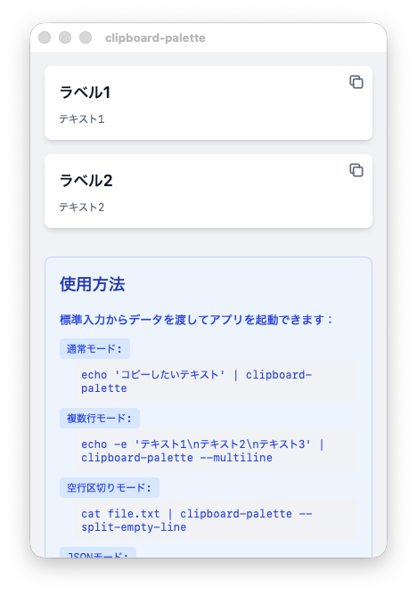

# clipboard-palette


An application that displays buttons to copy text from standard input to the clipboard.



## Installation & Build

### Setup Development Environment

```shell
npm install
```

### Run in Development Mode

```shell
npm run tauri dev
```

### Release Build

```shell
npm run tauri build
```

The built executable will be created at `src-tauri/target/release/clipboard-palette`.

## Usage

### Plain Text

```shell
echo "Hello, World!" | clipboard-palette
```

Displays a single button to copy `Hello, World!`.

### Multiline Text (--multiline, -m)

```shell
echo -e "Hello, World!\nこんにちは、世界！" | clipboard-palette --multiline
```

Splits by newlines and displays a copy button for each line.

### Split by Empty Lines (--split-empty-line, -s)

```shell
echo -e "Hello, World!\n\nこんにちは、世界！" | clipboard-palette --split-empty-line
```

Splits by a single empty line and displays a copy button for each section.

#### Split by N Consecutive Empty Lines

```shell
# Split by 2 or more empty lines
echo -e "Section1\n\nSection2\n\n\nSection3" | clipboard-palette --split-empty-line=2

# Alternative syntax
clipboard-palette --split-empty-line 2
clipboard-palette -s 2
```

By specifying a number, the text is split at N or more consecutive empty lines.

### JSON Format (--json, -j)

```shell
echo '[{"label": "Copy text", "text": "Hello, World!"}, {"label": "日本語", "text": "こんにちは、世界！"}]' | clipboard-palette --json
```

Accepts JSON input and displays buttons based on each object's `label` and `text` fields.

## Tests

The project includes test scripts for verification:

```shell
# Simple text
./tests/simple-text.sh

# Multiline text (split by empty lines)
./tests/multi-line-text.sh

# JSON format
./tests/json.sh
```

