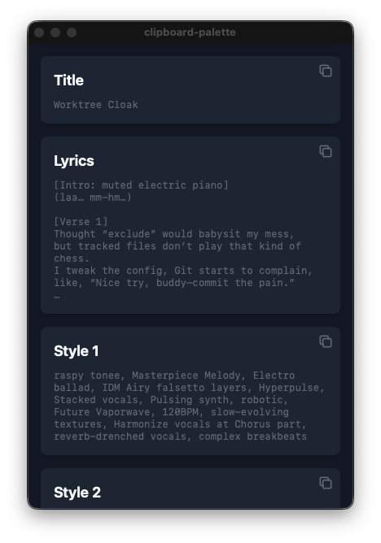
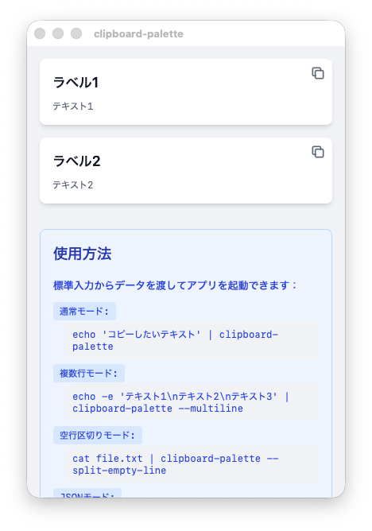

# clipboard-palette


An application that displays buttons to copy text from standard input to the clipboard.





## Download

Get the latest `clipboard-palette_<version>_universal.dmg` from the
[Releases page](https://github.com/ytyng/clipboard-palette/releases).
It is a universal binary (Intel + Apple Silicon), signed with a Developer ID
certificate and notarized by Apple, so it opens without a Gatekeeper warning.

This app reads from standard input, so it is meant to be launched from a shell.
After dragging it to `/Applications`, link the binary onto your `PATH`:

```shell
sudo ln -s /Applications/clipboard-palette.app/Contents/MacOS/clipboard-palette \
  /usr/local/bin/clipboard-palette
```

`/usr/local/bin` needs `sudo` unless Homebrew already took ownership of it.
Any other directory on your `PATH` (`~/.local/bin`, for example) works too.
All the examples under [Usage](#usage) assume this link exists.

## Installation & Build

### Setup Development Environment

```shell
npm install
```

### Run in Development Mode

```shell
npm run tauri dev
```

### Release Build

```shell
npm run tauri build
```

The built executable will be created at `src-tauri/target/release/clipboard-palette`.
A local build is ad-hoc signed (`signingIdentity: "-"`), so it is not distributable.

### Publish a Release

Bumps the version, pushes it to `main`, and runs the GitHub Actions release
workflow (build → Developer ID signing → notarization → GitHub Release).

```shell
npm run release              # 0.1.0 -> 0.1.1 (patch, default)
npm run release -- minor     # 0.1.0 -> 0.2.0
npm run release -- major     # 0.1.0 -> 1.0.0
```

Requires a clean working tree on `main` that matches `origin/main`, and an
authenticated `gh` CLI. See [documents/release.md](documents/release.md) for
details and the required repository secrets.

## Usage

### Help (--help, -h)

```shell
clipboard-palette --help
```

Prints the full help: available modes, the JSON format and examples. `-h` prints a short summary instead. `--version` / `-V` prints the version.

### Plain Text

```shell
echo "Hello, World!" | clipboard-palette
```

Displays a single button to copy `Hello, World!`. Leading and trailing whitespace is stripped.

If stdin is a terminal (no pipe), or the input is empty or whitespace only, sample data is displayed instead so you can try the app out.

### Multiline Text (--multiline, -m)

```shell
echo -e "Hello, World!\nこんにちは、世界！" | clipboard-palette --multiline
```

Splits by newlines and displays a copy button for each line. Blank lines are dropped.

### Split by Empty Lines (--split-empty-line, -s)

```shell
echo -e "Hello, World!\n\nこんにちは、世界！" | clipboard-palette --split-empty-line
```

Splits by a single empty line and displays a copy button for each section.

#### Split by N Consecutive Empty Lines

```shell
# Split at 2 consecutive empty lines
echo -e "Section1\n\nSection2\n\n\nSection3" | clipboard-palette --split-empty-line=2

# Alternative syntax
clipboard-palette --split-empty-line 2
clipboard-palette -s 2
```

By specifying a number, the text is split at N consecutive empty lines.

The separator is a literal run of N+1 newlines. This means CRLF input and lines holding only spaces do not separate sections, and any extra newlines stay at the head of the next section. `-s 0` splits on every newline.

### JSON Format (--json, -j)

```shell
echo '[{"label": "Copy text", "text": "Hello, World!"}, {"label": "日本語", "text": "こんにちは、世界！"}]' | clipboard-palette --json
```

Accepts JSON input and displays buttons based on each object's `label` and `text` fields.

JSON is never auto-detected, so `--json` is required. Without it, input that happens to start with `[` (a log line such as `[2026-07-30] ERROR: ...`, for example) is treated as plain text.

### Mode Precedence

Exactly one mode applies. If several are given, the first match in this list wins: `--multiline`, `--split-empty-line`, `--json`.

## Tests

The project includes test scripts for verification:

```shell
# Simple text
./tests/simple-text.sh

# Multiline text (split by empty lines)
./tests/multi-line-text.sh

# JSON format
./tests/json.sh
```

